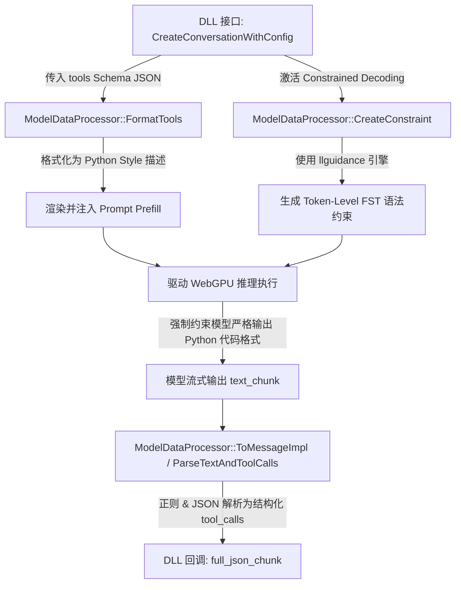

# LiteRT-LM MCP 协议实现机制与 UE5 插件集成方案技术分析报告

在面向虚幻引擎 5 (UE5) 开发高具身智能、高交互强度的 LLM 插件时，如何设计 **Model Context Protocol (MCP) / Tool Calling (函数调用)** 的拓扑架构是决定整个系统**操纵力、生命周期稳定性及通信性能**的战略核心。

本报告深入分析了 `liteRT-LM` 源码中关于 Tools 和约束解码的底层实现机制，并就“在 UE5 插件中实现 MCP 协议”与“调用 DLL 内部 MCP 协议”两种架构方案进行了深度对比，旨在为 **Winyunq** 的战略决策提供坚实的技术支撑。

---

## 一、 `liteRT-LM` 底层 Tools / Function Calling 实现机制分析

通过分析 `liteRT-LM` 引擎的 `runtime` 源码（特别关注 `Gemini_litert_lm_wrapper.cc`、`io_types.h` 以及 `gemma3_data_processor.cc`），可以得出以下核心技术结论：

### 1. 引擎内部的 “Tools” 并非网络层 MCP 协议
`liteRT-LM` 底层（DLL 暴露的 C 接口）**并没有实现** Anthropic 官方提出的基于网络通信（如 SSE、stdio 管道、WebSocket）的 MCP 协议栈。它所支持的 `tools` 本质上是 **Model-Level 的 Function Calling (函数调用) 机制**。

### 2. 闭环的底层处理管线
在 `liteRT-LM` 的 C++ 运行时中，Tools 经历了一个高度优化的闭环管道：



*   **格式化注入 (`FormatTools`)**：
    在 `gemma3_data_processor.cc` 中，模型在初始化会话（`JsonPreface`）时接收传入的 `tools` 定义，调用 `FormatToolAsPython` 转换为 Python 签名样式，并无缝注入到模型的预填提示词（Prefill Prompt）中。
*   **语法强约束 (`CreateConstraint`)**：
    这是 `liteRT-LM` 最核心的性能和体验保障。引擎通过集成 `llguidance`（或 `gemma_model_constraint_provider`），利用词法有限状态自动机 (FST) 产生 **Token 级别的强制约束 (Constrained Decoding)**。这使得模型在推理生成时，其生成的词元路径被死死卡在合法的 Python 函数调用语法树中（例如：` ```python\nfunc_name(arg1="val")\n``` `），从根本上避免了 LLM 在调用工具时因格式幻觉导致的解析失败。
*   **结构化解析 (`ToMessageImpl` / `ParseTextAndToolCalls`)**：
    当 WebGPU 推理管线输出 Token 后，`ParseTextAndToolCalls` 自动利用正则和 JSON 解析器把这些代码段转化为标准的 `tool_calls` JSON 数组，然后作为 `full_json_chunk` 通过 C 回调接口 `LiteRtLmCallback` 完整地抛给上层。

**核心结论：**
`liteRT-LM` 已经将 **Tool 的定义传入、Token 级格式约束、输出解析** 这三大技术难点在底层 DLL 内部完美地闭环处理了。它负责生成“完美的工具调用请求”，但 **绝对不负责去网络上执行这些工具，也不负责连接外部 MCP 服务器**。

---

## 二、 方案深度对比：UE5 插件实现 MCP vs DLL 内部实现 MCP

### 方案 A：在 UE5 插件中实现 MCP 协议 (UE5 扮演 Orchestrator 协调器) - 【战略推荐】

在该方案中，`liteRT-LM` DLL 保持其高效、纯粹的“推理计算核”定位，而 **UE5 插件则作为控制中枢**。UE5 负责维护本地 UFunction 的绑定、管理外部 MCP Servers 链接，并将 Tools 的 Schema 打包传给 DLL。

```
+-------------------------------------------------------------+
|                      UE5 (虚幻引擎)                         |
|  +------------------------+       +----------------------+  |
|  |     UE5 业务逻辑/关卡  |       |   虚幻本地 API (Tools) |  |
|  +-----------+------------+       +----------+-----------+  |
|              |                               |              |
|  +-----------v-------------------------------v-----------+  |
|  |             UE5 插件 (MCP Client / 任务协调器)           |  |
|  |                                                       |  |
|  | 1. 获取本地/外部 MCP Tools 并拼接成 JSON Schema         |  |
|  | 2. 解析 DLL 返回的 tool_calls                         |  |
|  | 3. 分发调用 (虚幻内部/外部 MCP Server) 并拼接结果        |  |
|  +----+----------------------------------------------^----+  |
+-------|----------------------------------------------|------+
        | (1. 传递 tools schema)                        | (3. 回调 tool_calls JSON)
        | (2. 触发 RunInference)                       |
+-------v----------------------------------------------+------+
|                    LiteRT-LM DLL (C++ / Rust)               |
|  +-------------------------------------------------------+  |
|  | 1. CreateConversationWithConfig(tools JSON)           |  |
|  | 2. 自动格式化 Tools 为 prompt 并注入 llguidance 语法约束 |  |
|  | 3. 运行 WebGPU 推理，在 Callback 中吐出结构化 JSON    |  |
|  +-------------------------------------------------------+  |
+-------------------------------------------------------------+
```

#### 优势：
1.  **UE 生态操纵力无上限**：
    在虚幻引擎中，核心的交互工具通常是**引擎内部接口**（如 `SpawnActor`、修改材质参数、播放声效、查询资产等）。UE 插件可以直接利用自身的 C++ 反射系统和蓝图虚拟机，无缝、安全地在 **Game Thread (游戏主线程)** 执行这些 Tool Calls，彻底阻断多线程安全冲突。
2.  **避免 DLL 第三方库污染与版本冲突**：
    MCP 协议涉及网络通信（HTTP/SSE/WebSocket 等）。若在 UE 插件侧实现，可以利用 UE 内置的 `IHttpRequest`、`IWebSocket` 或虚幻已有的异步通信系统，无需在 DLL 内部集成 libcurl、boost.asio 等可能引起链接和打包冲突的第三方库。
3.  **完美的第三方 MCP Server 路由能力**：
    UE 插件可以轻松集成标准的 MCP 客户端逻辑，直接通过 stdio 或 SSE 路由到外部已经极度丰富的 MCP Servers（例如获取文件树的本地 Server、执行网络搜索的远程 Server 等），无需在 DLL 内做复杂的网络寻址。

#### 劣势：
1.  需要虚幻插件的开发者实现 MCP 客户端协议的解析路由逻辑（但虚幻侧解析 JSON 和通信框架非常成熟，且有现成开源插件可作为轮子参考）。

---

### 方案 B：在 DLL 内部实现 MCP 协议 (DLL 扮演桥接器/通信端)

在该方案中，DLL 不仅负责本地模型推理，还需要自己集成 TCP/HTTP 客户端去连接外部的 MCP Servers，或者自建 stdio 管道来处理协议通信，对 UE 插件暴露出类似于“完全自治的智能体”的极其简化的接口。

#### 优势：
1.  对 UE5 插件开发者极其友好。UE 侧只需要调用一个“黑盒”接口，所有复杂的 Tool Call 循环、外部 API 网络请求全在 DLL 内部自动搞定。

#### 核心痛点与硬伤（战略致命伤）：
1.  **对虚幻引擎的操作极其受限（战略死穴）**：
    由于 DLL 处于 UE 进程的外部或处于没有 UE 反射上下文的纯 C++ 环境中，**DLL 无法直接访问 UWorld、Actor 或调用任何蓝图/C++ 虚幻底层 API**。如果模型输出的 `tool_call` 是要在 UE 场景中生成一个金币（`SpawnActor`），DLL 根本做不到。
2.  **无法避免的回调冗余**：
    为了解决上一条问题，DLL 必须将所有与引擎相关的 Tool Calls，通过定义非常复杂的跨 DLL 函数指针回调（Callback）丢给 UE。这相当于在 DLL 内部将网络传来的 MCP 封装成一次 C-API 回调，然后 UE 处理完再丢给 DLL，DLL 再次打包扔回去。这实际上是强行在 DLL 内包了一层网络与分发逻辑，增加了极大的冗余和崩溃隐患（极易发生野指针悬空或内存泄漏）。
3.  **多线程与死锁隐患**：
    UE5 对线程有极其严苛的要求，所有操纵渲染管线和世界场景的操作 **必须在 Game Thread (游戏主线程) 执行**。而 DLL 的推理是在 WebGPU 异步后台线程上跑的。如果在 DLL 内阻塞式等待虚幻主线程去完成某个 Tool，极易导致主线程死锁。而在 UE 插件中利用 Task Graph 异步调度则非常自然。
4.  **动态库膨胀与链接冲突**：
    为了在 DLL 内部实现完整的网络 MCP 通信，必须打包集成诸如 curl、openssl、nlohmann_json 等库，虚幻引擎在编译打包时经常会对这类型外部冲突敏感，会引发极大的工程问题。

---

## 三、 战略与战术推荐（Winyunq 终极架构设计）

为了在人机协作和项目工程开发中实现**“扩大产出，稳定产出”**的核心战略，我们采用 **Winyunq 经典工程架构分层原则**：

> **“战略归战略，引擎归引擎，算力归算力”**

### 1. 架构定型（战术执行决策）
我们应当 **在 UE5 插件中实现 MCP 协议与工具路由分发逻辑，调用 DLL 内部提供的 Raw Function Calling 编解码与语法约束能力**。

*   **算力层 (LiteRT-LM DLL)**：
    只专注于通过 WebGPU / NPU 进行本地高速算力输出，仅对外提供带 Tools JSON 的会话创建（`LiteRtLm_CreateConversationWithConfig`）及推理流接口。底层利用 `llguidance` 的 Grammar 强约束确保 LLM 吐出的 JSON 格式是 100% 正确的。
*   **控制层 / 协议层 (UE5 插件)**：
    作为 **MCP 调度总枢纽**。在虚幻中通过 C++ 或蓝图实现 MCP 客户端（或者标准的 Tool 分发路由）。
    *   **游戏内工具 (In-game Tools)**：由 UE 插件直接在游戏线程中反射调用，操纵游戏世界。
    *   **外部辅助工具 (System/OS Tools)**：由 UE 插件通过 TCP/HTTP 转发至现成的外部 MCP 节点，执行完成后送回 DLL 推理管线。

### 2. 接口层交互伪代码设计 (UE5 插件与 DLL 握手流程)

当用户在 UE5 插件中开启一个带 Tools 的智能对话时，典型的数据流转如下：

#### Step 1: UE5 插件收敛本地与外部的所有 Tools 描述
```json
// tools_preface.json
{
  "messages": [
    {"role": "system", "content": "你是一个能够操纵虚幻世界的具身智能体。"}
  ],
  "tools": [
    {
      "name": "SpawnActorInWorld",
      "description": "在虚幻引擎关卡中的指定位置生成一个指定的Actor类",
      "parameters": {
        "type": "object",
        "properties": {
          "ClassName": {"type": "string", "description": "要生成的类名"},
          "LocationX": {"type": "number"},
          "LocationY": {"type": "number"},
          "LocationZ": {"type": "number"}
        },
        "required": ["ClassName", "LocationX", "LocationY", "LocationZ"]
      }
    }
  ]
}
```

#### Step 2: 初始化 DLL 会话并传递 Schema
```cpp
// UE5 C++ 插件端
void* EnginePtr = LiteRtLm_CreateEngine(MyConfig);
// 初始化时传入 tools JSON，激活 llguidance 语法强约束，防止模型工具调用格式幻觉崩溃
void* ConvPtr = LiteRtLm_CreateConversationWithConfig(EnginePtr, TStringConvert<char>::Convert(ToolsJsonStr), 1); 
```

#### Step 3: 发起增量推理，并在回调中分发 Tool Call
```cpp
// 1. 追加用户指令
LiteRtLm_AppendUserMessage(ConvPtr, "{\"role\": \"user\", \"content\": \"请在坐标 (100, 200, 50) 处为我生成一个宝箱。\"}");

// 2. 回调函数接收结构化的 tool_calls
auto MyCallback = [](LiteRtLm_Result Result, void* UserPtr) {
    if (Result.full_json_chunk) {
        nlohmann::json Response = nlohmann::json::parse(Result.full_json_chunk);
        if (Response.contains("tool_calls")) {
            // UE5 插件捕获到结构化的 tool_calls，准备执行
            for (auto& ToolCall : Response["tool_calls"]) {
                std::string FuncName = ToolCall["function"]["name"];
                auto Args = ToolCall["function"]["arguments"];
                
                // 将执行任务抛到 UE5 游戏主线程 (Game Thread) 去操纵引擎！
                AsyncTask(ENamedThreads::GameThread, [FuncName, Args]() {
                    UE5_ToolDispatcher::Execute(FuncName, Args);
                });
            }
        }
    }
};

// 3. 执行非阻塞 WebGPU 异步推理
LiteRtLm_RunInference(ConvPtr, MySamplingParams, MyCallback, this);
// 4. 等待完成
LiteRtLm_WaitUntilDone(EnginePtr, 0);
```

通过这一套经过高度优化的战术架构：
1.  **极高内聚性**：DLL 只用管 WebGPU 深度学习计算与约束，完全是线程安全的，对内存泄漏和死锁免疫。
2.  **极高灵活性**：所有环境操纵的逻辑（MCP 客户端的通信、UE 世界里的渲染生成）都在 UE5 插件中以第一公民身份被调度，拥有虚幻引擎的绝对操纵权。
3.  **终极战略胜利 (Winyunq)**：这一架构既将 DLL 的算力性能发挥到极限，又把 UE5 的生态操纵力放到最大，保证了人机开发协作中的“最大化产出”目标！
