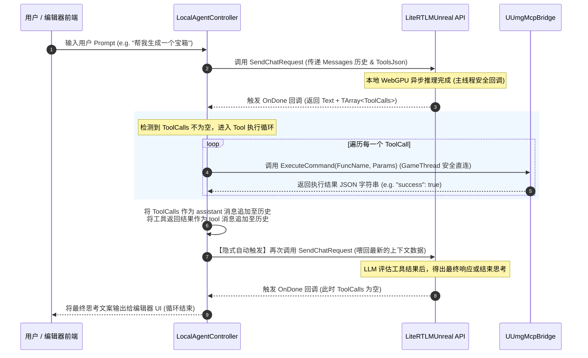

# UE5 插件内本地 LiteRT-LM 与 MCP 工具链无缝集成方案设计与 Gap 分析

在深入研究了 UE5 插件 `UmgMcp` 中的命令分发机制（`UmgMcpBridge.cpp`）以及本地推理包 `LiteRTLMUnreal` 的暴露 API （`LiteRtLmUnrealApi.h`）后，我们得出了一个极其振奋的战略性结论：

**底层的基础设施和技术拼图已经完全闭环。**
1.  **`LiteRTLMUnreal` 插件**：提供了极简且极其成熟的 `SendChatRequest` 接口，支持注入 Tools JSON，并且其流式 text 回调和 DONE 回调**已经做好了游戏主线程（Game Thread）的调度 Marshalling**。它吐出的结果直接携带了 OpenAI 兼容的结构化 `ToolCalls` 数组（`TArray<TSharedPtr<FJsonObject>>`）。
2.  **`UmgMcp` 插件 (Bridge)**：已经开发了极其庞大、完备的、专门用于操纵虚幻 UMG、蓝图低阶 Graph、材质及 Sequencer 的 Commands Handler。同时，`UUmgMcpBridge::ExecuteCommand` 支持从 Game Thread 直接以 C++ 形式（无需走 TCP 网络）调用这些本地 Tools。

这意味着，我们完全可以丢弃低效且复杂的网络 TCP 管道，**在虚幻内部把这两大插件以“API 直连”的黑盒方式直接接通**。

为了实现这一目标，我们需要在 UE5 插件一侧完成以下四项核心的 **额外工作 (Gap Analysis & Engineering Tasks)**。

---

## 额外工作一：开发“本地智能体循环控制器 (Local Agent Loop Pump)” 【最核心 GAP】

### 痛点背景
在传统的 TCP/HTTP 网络模式下，外部大模型充当主动发出网络请求的 Client，`UUmgMcpBridge` 充当被动监听并执行的 TCP Server。
但在本地 LiteRT-LM 模式下，**没有了网络 TCP 交互**。大模型和虚幻执行器同在本地。我们需要在虚幻内开发一个主动的“状态机”，来调度大模型与工具执行的冷热交替循环（Agent Loop）。

### 战术实现设计
需要在 `UmgMcp` 插件中新建一个 `UObject` 类或 Subsystem（例如 `UUmgMcpLocalAgentController`），充当本地调度状态机，实现以下交互控制环（如下图所示）：



---

## 额外工作二：UE5 本地 Tools Schema 自动收敛注册中心 【保障 constrained decoding 的关键】

### 痛点背景
`LiteRTLMUnreal` 的底层约束解码器（`llguidance`）要求大模型在初始化会话时获得所有可调用工具的完整 JSON Schema（通过 `json_preface_str` 中的 `tools` 字段）。
目前 `UmgMcpBridge.cpp` 中硬编码了几十种 `CommandType`。我们不能在大脑端手动硬编码这些 Schema，而应该由虚幻插件在运行时自动收集并暴露出来。

### 战术实现设计
1.  **定义标准 Schema 接口**：
    在虚幻中为各个 Command Handler 类（如 `FUmgMcpWidgetCommands`、`FUmgMcpBlueprintCommands` 等）开发一个公共的 Schema 描述接口：
    ```cpp
    // 示例：在各 Commands 类中提供收集函数
    TArray<TSharedPtr<FJsonObject>> GetSupportedToolsSchema();
    ```
2.  **Schema 注册中心**：
    在 `UUmgMcpBridge` 中提供一个注册中心，汇总所有 Handler 的 Schema。在启动或初始化 `LiteRTLM` 会话前，将这几十个 Commands 的 JSON 格式定义拼装成一个全局的 `ToolsJson` 字符串输入给 `FLiteRtLmUnrealApi::SendChatRequest`。
    
    *有了这步，底层的 FST 约束自动机才能精准拦截大模型的 Token 输出，确保其本地生成的 `ToolCalls` 格式 100% 满足虚幻入参要求。*

---

## 额外工作三：避免“流式 & 异步回调”下的死锁设计（Thread-Safe Non-blocking Queue）

### 痛点背景
目前 `UmgMcpBridge.cpp` 中的 `ExecuteCommand` 在处理非游戏线程的调用时，使用的是以下阻塞式设计：
```cpp
// UmgMcpBridge.cpp : Line 259
AsyncTask(ENamedThreads::GameThread, [this, CommandType, Params, Promise = MoveTemp(Promise)]() mutable
{
    FString Result = InternalExecuteCommand(CommandType, Params);
    Promise.SetValue(Result);
});
// 阻塞等待主线程执行完毕
if (Future.WaitFor(FTimespan::FromSeconds(MCP_GAME_THREAD_TIMEOUT_DEFAULT))) { ... }
```
这对于外部 TCP 客户端是可以的。但若本地 LiteRT-LM 的 C-API 回调在异步线程同步调用这个函数并进行 `WaitFor` 阻塞，一旦主线程在等待大模型推理数据或者大模型推理工作流中持有了主线程某些资源，**瞬间会导致编辑器发生双向锁死（Deadlock）**。

### 战术实现设计
由于 `FLiteRtLmUnrealApi::SendChatRequest` 的 `OnDone` 回调 **已经设计为在游戏主线程（Game Thread）触发**：
*   **重构策略**：我们在本地 Agent 循环中，**彻底废除同步阻塞等待**。
*   当 `OnDone` 被触发时，我们直接已经在主线程（Game Thread）上了。所以我们可以直接通过 C++ 的 `InternalExecuteCommand` **同步、高效、安全地瞬间执行完所有的本地 Commands**。
*   执行完毕后，直接在主线程中组装新的消息并异步重新调用 `SendChatRequest`。这样整个推理和工具执行就像是“接力棒式”在主线程和推理线程之间安全交替，彻底杜绝死锁隐患。

---

## 额外工作四：动态编辑器上下文感知注入（Auto Context Injection）

### 痛点背景
在网络 MCP 架构下，外部大模型大脑极其“迟钝”。它要获取当前场景选中了什么 Widget 或 Actor，必须显式发送 `get_last_edited_umg_asset`、`get_actors_in_level` 等 Tool Calls 来回拉扯，不仅增加了推理开销，而且显得极其不智能。

### 战术实现设计
由于模型和执行都在虚幻进程内部，我们可以设计 **“主动感知感知区 (Active Context Feeding)”**：
1.  在每次 `LocalAgentController` 触发大模型 `SendChatRequest` 前，**自动、隐式地感知当前编辑器的最新状态**：
    *   当前通过 `UUmgAttentionSubsystem` 锁定的 Widget 资产路径；
    *   当前选中的 Actor 名称与坐标；
    *   当前打开的蓝图图表或材质编辑器上下文。
2.  将这些最实时的上下文动态序列化为一个临时的 `extra_context` JSON，拼装进会话的 System Messages 首部。
3.  这样本地大模型在“睁开眼”的瞬间，就已经持有了虚幻世界最精准的感官状态，无需反复发送感知指令探路，极大地扩大了智能体的生成产出效率！
